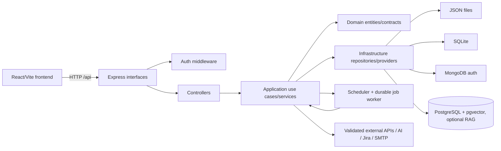

# Architecture

## Current system

TestForge is a browser application backed by an Express API. It imports API contracts and documentation, manages project-scoped test data and requirements, generates/maps test designs, executes requests, schedules suites, and produces reports.



## Repository layout

- `frontend/src/app`, `routes`, `modules`, `components`, `layouts`, `services`, `hooks`, `store`, `utils`: UI bootstrap, feature modules, shared UI, API access, client state, and helpers.
- `backend/src/interfaces`: Express route registration, controllers, middleware, and DTO boundaries.
- `backend/src/application`: use cases, orchestration, dependency container, execution, RAG, and services.
- `backend/src/domain`: entities, value/validation rules, repository contracts, and provider-neutral types.
- `backend/src/infrastructure`: JSON/SQLite/in-memory repositories, auth/Mongo, logging, security, database, embeddings, and external adapters.
- `e2e`: Playwright production-artifact tests and a local fixture API server.
- `docs`, `.github/workflows`, and Docker Compose files document deployment and CI.

## Request and frontend flow

`frontend/src/app/main.tsx` mounts `App` in `React.StrictMode`, imports `styles/index.css`, and `App.tsx` installs `QueryClientProvider`, `BrowserRouter`, auth bootstrap, and routes. Axios/API service modules call `/api`; TanStack Query owns server cache and Zustand owns selected project, auth, theme, notifications, and execution state. A user change clears the Query cache.

The backend loads the root `.env`, validates configuration, installs CORS/security headers, optional rate limiting, JSON parsing, metrics, auth, project authorization, then registers feature routes and final 404/error handlers. Most API routes are mounted under `/api`; `/health`, `/ready`/`/readiness`, and `/metrics` are process endpoints.

## Backend boundaries

The normal dependency direction is:

```text
HTTP route -> controller/interface -> application service/use case -> domain contract/entity -> infrastructure adapter -> storage/provider
```

`backend/src/application/ApplicationContainer.ts` composes modules. Routes should remain thin; business rules belong in application/domain code, and persistence/provider details belong in infrastructure. AI code uses provider-neutral application contracts such as `ChatModelProvider`, `StructuredAiGenerator`, `AiModelResolver`, and `AiInvocationPolicy`; embeddings are a separate `EmbeddingProvider` path.

## Persistence and runtime execution

The default repository set is file-based JSON under `backend/data`, with per-file locking. Selected modules use SQLite (`DB_PATH`), and some services are in-memory. MongoDB is used for enterprise user accounts when `MONGODB_URI` is configured. Optional RAG uses `RAG_DATABASE_URL` PostgreSQL with pgvector migrations and optional Ollama embeddings; it is separate from primary application persistence.

The scheduler and durable job worker start during bootstrap. The activity stream hub is also process-local. Jobs, schedules, audit records, and local secrets depend on the persistent application data volume in the documented single-node topology. Graceful shutdown stops these services and closes Mongo/Postgres connections.

Production/staging currently support an explicitly single-node JSON deployment (`TESTFORGE_ALLOW_SINGLE_NODE_JSON=true`). Distributed coordination is configuration-gated and the current JSON repository set is not a multi-instance architecture; database-backed repositories/job/lease adapters are required before HA.

## Auth and authorization

`authenticate` accepts a constant-time compared `x-api-key` or a verified JWT bearer token. JWTs must provide `sub` and either a `projects` scope (`string[]` or `*`) or `tenantId`. Project routes use `authorizeProject`, which checks token scope and then owner/tenant lookup. Global operations such as backups and metrics use `assertGlobalAccess`. Enterprise login is MongoDB-backed and issues JWT sessions. Local auth-disabled development is an intentional compatibility path; deployment config requires auth.

## External integrations

The backend contains adapters for API execution, Jira, SMTP, AI providers, Ollama embeddings, MongoDB, and PostgreSQL. Server-side outbound execution passes through `OutboundNetworkPolicy`; environment policies may allow explicit hosts/ports and development loopback/private access. The frontend also performs direct API-test requests from the browser for the API workspace. Webhooks, plugins, imports, backups, and reports are separate interfaces registered from `backend/src/index.ts`.

## Transitional/legacy paths

- JSON/file persistence is current and intentionally single-node, while SQLite and optional RAG are partial/selected subsystems rather than one uniform database architecture.
- The legacy environment page redirects to the API workspace; environment management remains part of API execution.
- Local development may run without authentication; staging/production must not.
